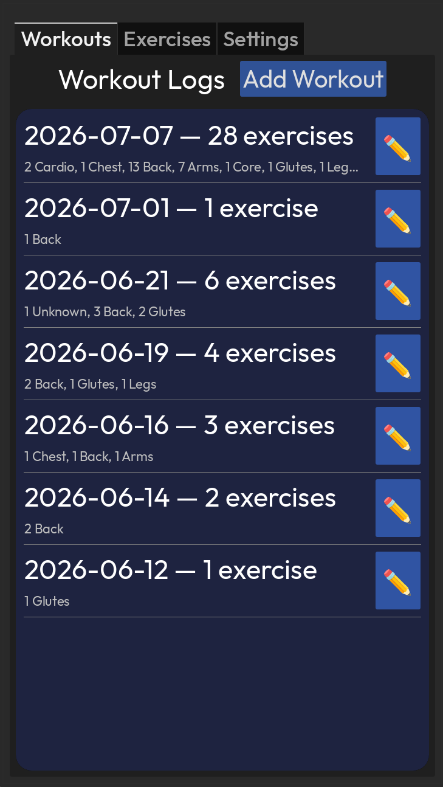

# Workout

Basic offline workout tracker.

## Future Ideas

### High

### Med
 - Import feature

### Low
- Show error message when saving an incomplete workout/exercise 
- Color settings menu for text/background, allow user to set various theme colors
- Drag sort for global exercise list and workout exercise list. Updates the default sorting (stored in json)
- When adding dates, optionally pick from a calendar widget instead of typing date by hand
- Export to google drive if possible

# Screenshots

